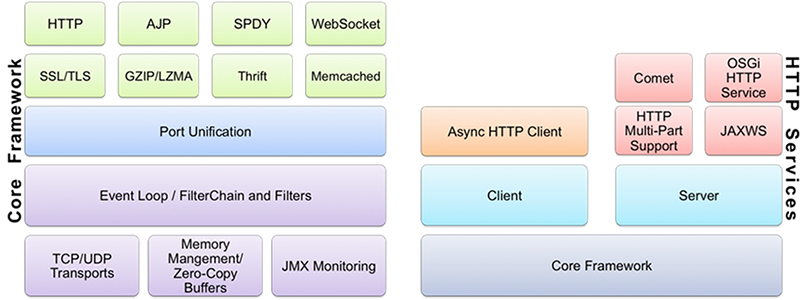

### Grizzly框架组件 
使用 Java™编程语言编写可扩展的服务器应用程序一直很困难。在 Java 新 I/O API （NIO） 出现之前，线程管理问题使服务器无法扩展到数千个用户。
Grizzly NIO 框架旨在帮助开发人员利用 Java™ NIO API。Grizzly 的目标是帮助开发人员使用 NIO 构建可扩展和强大的服务器，
并提供扩展的框架组件：Web 框架 （HTTP/S）、WebSocket、Comet等！




### 快速开始
本章将介绍客户端和服务器端如何开始使用Grizzly 2.3。
首先，有必要依靠正确的[Grizzly 2.4 核心版本](https://maven.java.net/content/repositories/releases/org/glassfish/grizzly/grizzly-framework/)。
Maven开发人员将需要向pom添加以下依赖项：
```xml
<dependency>
    <groupId>org.glassfish.grizzly</groupId>
    <artifactId>grizzly-framework</artifactId>
    <version>2.4.0</version>
</dependency>
```

所有的Grizzly Maven工件都部署在[Maven Central](http://repo1.maven.org/)存储库中。

让我们实现简单的Echo客户端-服务器应用程序。客户端将从标准输入中获取用户数据，将数据发送到Echo服务器，并将服务器的响应重定向到标准输出。Echo服务器的职责是从网络通道读取数据，并将相同的数据回显到通道。

### 服务器

#### 创建回声过滤器(Echo filter)
首先，让我们实现回声过滤器(echo filter)，该过滤器会将收到的消息（不考虑其类型）回显到 Grizzly Connection。
```xml
import java.io.IOException;
import org.glassfish.grizzly.filterchain.BaseFilter;
import org.glassfish.grizzly.filterchain.FilterChain;
import org.glassfish.grizzly.filterchain.FilterChainContext;
import org.glassfish.grizzly.filterchain.NextAction;

/**
 * Implementation of {@link FilterChain} filter, which replies with the request
 * message.
 */
public class EchoFilter extends BaseFilter {

    /**
     * Handle just read operation, when some message has come and ready to be
     * processed.
     *
     * @param ctx Context of {@link FilterChainContext} processing
     * @return the next action
     * @throws java.io.IOException
     */
    @Override
    public NextAction handleRead(FilterChainContext ctx)
            throws IOException {
        // Peer address is used for non-connected UDP Connection :)
        final Object peerAddress = ctx.getAddress();

        final Object message = ctx.getMessage();

        ctx.write(peerAddress, message, null);

        return ctx.getStopAction();
    }
}
```

### 服务器初始化代码
服务器的所有FilterChain块都已准备好-让我们初始化并启动服务器。

```java
import java.io.IOException;
import java.nio.charset.Charset;
import java.util.logging.Logger;
import org.glassfish.grizzly.filterchain.FilterChainBuilder;
import org.glassfish.grizzly.filterchain.TransportFilter;
import org.glassfish.grizzly.nio.transport.TCPNIOTransport;
import org.glassfish.grizzly.nio.transport.TCPNIOTransportBuilder;
import org.glassfish.grizzly.utils.StringFilter;

/**
 * Class initializes and starts the echo server, based on Grizzly 2.3
 */
public class EchoServer {
    private static final Logger logger = Logger.getLogger(EchoServer.class.getName());

    public static final String HOST = "localhost";
    public static final int PORT = 7777;

    public static void main(String[] args) throws IOException {
        // Create a FilterChain using FilterChainBuilder
        FilterChainBuilder filterChainBuilder = FilterChainBuilder.stateless();

        // Add TransportFilter, which is responsible
        // for reading and writing data to the connection
        filterChainBuilder.add(new TransportFilter());

        // StringFilter is responsible for Buffer <-> String conversion
        filterChainBuilder.add(new StringFilter(Charset.forName("UTF-8")));

        // EchoFilter is responsible for echoing received messages
        filterChainBuilder.add(new EchoFilter());

        // Create TCP transport
        final TCPNIOTransport transport =
                TCPNIOTransportBuilder.newInstance().build();

        transport.setProcessor(filterChainBuilder.build());
        try {
            // binding transport to start listen on certain host and port
            transport.bind(HOST, PORT);

            // start the transport
            transport.start();

            logger.info("Press any key to stop the server...");
            System.in.read();
        } finally {
            logger.info("Stopping transport...");
            // stop the transport
            transport.shutdownNow();

            logger.info("Stopped transport...");
        }
    }
}
```

#### 运行回显服务器(Echo Server)
正如我们在上面的代码中看到的那样，EchoServer类声明了main方法，使用IDE运行 main 方法。

### 客户
    
#### 创建客户端过滤器
客户端过滤器负责将服务器响应重定向到标准输出。请注意，ClientFilter要求FilterChainContext消息为java.lang.String（第21行），
因此它依赖于StringFilter在FilterChain中位于它之前。
```java
import java.io.IOException;
import org.glassfish.grizzly.filterchain.BaseFilter;
import org.glassfish.grizzly.filterchain.FilterChainContext;
import org.glassfish.grizzly.filterchain.NextAction;

/**
 * Client filter is responsible for redirecting server response to the standard output
 */
public class ClientFilter extends BaseFilter {
    /**
     * Handle just read operation, when some message has come and ready to be
     * processed.
     *
     * @param ctx Context of {@link FilterChainContext} processing
     * @return the next action
     * @throws java.io.IOException
     */
    @Override
    public NextAction handleRead(final FilterChainContext ctx) throws IOException {
        // We get String message from the context, because we rely prev. Filter in chain is StringFilter
        final String serverResponse = ctx.getMessage();
        System.out.println("Server echo: " + serverResponse);

        return ctx.getStopAction();
    }
}

```

#### 客户端初始化代码
现在我们准备初始化客户端，包括FilterChain和Transport初始化。
```java
Connection connection = null;

// Create a FilterChain using FilterChainBuilder
FilterChainBuilder filterChainBuilder = FilterChainBuilder.stateless();

// Add TransportFilter, which is responsible
// for reading and writing data to the connection
filterChainBuilder.add(new TransportFilter());

// StringFilter is responsible for Buffer <-> String conversion
filterChainBuilder.add(new StringFilter(Charset.forName("UTF-8")));

// ClientFilter is responsible for redirecting server responses to the standard output
filterChainBuilder.add(new ClientFilter());

// Create TCP transport
final TCPNIOTransport transport =
        TCPNIOTransportBuilder.newInstance().build();
transport.setProcessor(filterChainBuilder.build());
```

#### 添加用户交互和客户端关闭代码

让我们通过添加逻辑来完成上面的代码，该逻辑从标准输入读取用户数据，将其发送到服务器，并在输入结束时执行客户端关闭。
```java
   package com.huyouxiao.loquat;
   
   import org.glassfish.grizzly.Connection;
   import org.glassfish.grizzly.Grizzly;
   import org.glassfish.grizzly.filterchain.FilterChainBuilder;
   import org.glassfish.grizzly.filterchain.TransportFilter;
   import org.glassfish.grizzly.nio.transport.TCPNIOTransport;
   import org.glassfish.grizzly.nio.transport.TCPNIOTransportBuilder;
   import org.glassfish.grizzly.utils.StringFilter;
   
   import java.io.BufferedReader;
   import java.io.IOException;
   import java.io.InputStreamReader;
   import java.nio.charset.Charset;
   import java.util.concurrent.ExecutionException;
   import java.util.concurrent.Future;
   import java.util.concurrent.TimeUnit;
   import java.util.concurrent.TimeoutException;
   import java.util.logging.Logger;
   
   public class EchoClient {
       private static final Logger logger = Grizzly.logger(EchoClient.class);
   
       public static void main(String[] args) throws IOException,
               ExecutionException, InterruptedException, TimeoutException {
   
           Connection connection = null;
   
           // Create a FilterChain using FilterChainBuilder
           FilterChainBuilder filterChainBuilder = FilterChainBuilder.stateless();
           // Add TransportFilter, which is responsible
           // for reading and writing data to the connection
           filterChainBuilder.add(new TransportFilter());
           // StringFilter is responsible for Buffer <-> String conversion
           filterChainBuilder.add(new StringFilter(Charset.forName("UTF-8")));
           // Client is responsible for redirecting server responses to the standard output
           filterChainBuilder.add(new ClientFilter());
   
           // Create TCP transport
           final TCPNIOTransport transport = TCPNIOTransportBuilder.newInstance().build();
           transport.setProcessor(filterChainBuilder.build());
   
           try {
   
               // Start the transport
               transport.start();
   
               // perform async. connect to the server
               Future<Connection> future = transport.connect(EchoServer.HOST, EchoServer.PORT);
   
               // wait for connect operation to complete
               connection = future.get(10, TimeUnit.SECONDS);
   
               assert connection != null;
   
               logger.info("Ready...(\"q\" to exit)");
               final BufferedReader inReader = new BufferedReader(new InputStreamReader(System.in));
               do {
                   final String userInput = inReader.readLine();
                   if (userInput == null || "q".equals(userInput)) {
                       break;
                   }
   
                   connection.write(userInput);
               } while (true);
           } finally {
               // close the client connection
               if (connection != null) {
                   connection.close();
               }
   
               // stop the transport
               transport.shutdownNow();
           }
       }
   }
```

#### 运行回显客户端
用 IDE 运行 EchoClient 的 main 方法。
或您最喜欢的IDE。
默认情况下，如果标准输入和输出未更改-您将在控制台上看到以下内容：
```jshelllanguage
Ready... ("q" to exit)
```
现在客户端已准备好您的输入。每次键入一行并按<ENTER>键-该行将被发送到服务器，并且响应如下：
```jshelllanguage
Ready... ("q" to exit)
Hey there!
Server echo: Hey there!
```
